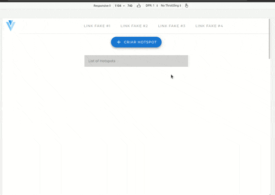

## Hottest :fire:
Teste para desenvolvedor frontend: Aplicação que cria e gerencia Hotspots


Link para a descriçao do teste <br>
<https://github.com/Conpass/challenges/blob/master/Frontend-Challenge.md>




#### Notas
Testado no Firefox e Chrome


#### Abaixo as instruções default para instalação e execução

### Project setup 
```
npm install
```

#### Compiles and hot-reloads for development
```
npm run serve
```

